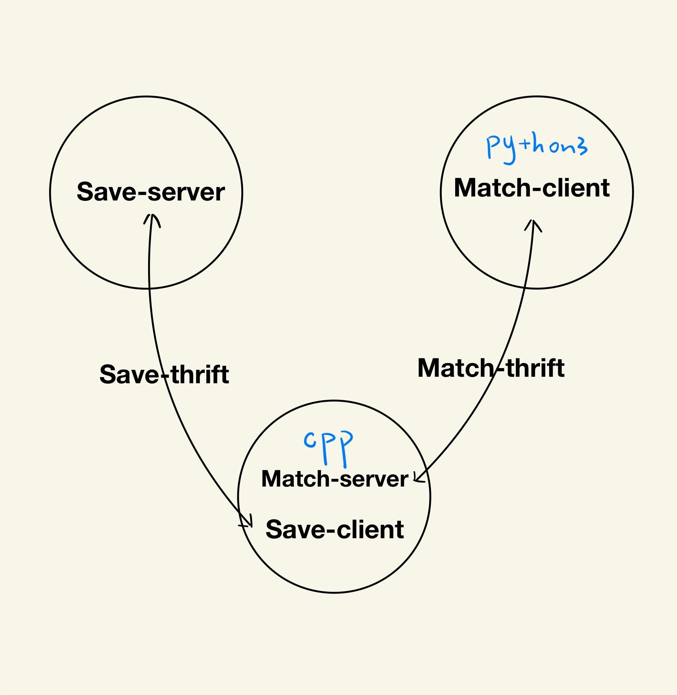

## thrift
***

### 匹配系统的实现
我们写一个应用时，这个应用程序并不止一个服务，例如匹配系统要同时将匹配服务分配到多个服务器（进程）上。  

#### thift 介绍
thrift 是一个跨语言的 rpc 服务框架，用户通过 Thrift 的 IDL（接口定义语言）描述接口函数及数据类型，通过 Thrift 的编译环境生成各种语言类型的接口文件，用户可以根据自己的需要采用不同的语言开发客户端代码和服务器端代码。

#### 匹配系统组成
匹配系统主要由三部分（节点）组成：1. 游戏节点 2. 匹配节点 3. 数据存储节点。其中有两个主要功能，分别是匹配功能 match，和数据存储功能 save。

游戏节点就是作为匹配功能 match 的 client 端，其主要功能是调用 server 端中的两个函数，分别是 add_user 添加一名玩家，remove_user 删除一名玩家

匹配节点不仅作为匹配功能 match 的 server 端，也作为数据存储功能的 save 的 client 端。作为匹配功能 match 的 server 端时主要实现了 add_user 和 remove_user 两个函数  

数据存储节点就是作为数据存储功能 save 的 server 端，主要实现的函数就是 save_data 存储数据

每个客户端-服务端都由 thrift 定义的服务接口作为有向边进行连接，服务器端用 c++ 实现，客户端用 python 实现

#### 开发流程
1. 生成 thrift 接口，本次项目中先生成 match_thrift 接口  
   接口中需要初始化，本次项目初始化了数据类型，结构体和命名空间  
   本次项目根据用户 id，用户名，和分值进行匹配，命名空间为 cpp
2. 通过 match.thrift 接口构建服务端和客户端，先不用完成具体业务逻辑，写上基本的输出信息跑通即可
3. 完成 match_client 端的需求，实现可以从终端读取输入即可
4. 完成 match_server 端的需求（重点），包括多线程，消息队列，锁等
5. 通过 save.thrift 结构构建服务端（已经实现好了）和客户端，将 save_client 和 match_server 合并
6. 根据业务完善匹配节点

#### 匹配节点中的细节
由于匹配系统既要完成用户的添加，同时又要将用户进行匹配，本质上就是需要程序并行执行，也就是需要开多线程  

本次项目用到的是生产者消费者模型，用户的添加就是生产者 A，用户匹配后删除就是消费者 B，多线程用消息队列 message_queue（锁 mutex + 条件变量 condition_variable）手写实现

在 add_user 和 remove_user 函数中向消息队列中添加元素，通过锁保证这两个函数在同一时刻只能有一个函数执行向队列中添加元素的操作

在消费者函数 consume_tast 中，同样要进行上锁，如果队列元素为空，就应该将该函数（进程）阻塞，阻塞的方法通过条件变量休眠实现，当 add_user 和 remove_user 开始向队列中添加元素了，就可以通过唤醒条件变量，让消费者继续执行

class pool 匹配池用来实现具体的函数

#### 匹配系统用到的基本概念
- 多线程thread：一个程序是一个进程，一个进程中至少有一个线程。如果只有一个线程，则第二个任务必须等到第一个任务结束后才能进行，如果使用多线程则在主线程执行任务的同时可以执行其他任务，而不需要等待。创建线程代价较小，但能有效提升cpu利用率。

- 生产者消费者模型：假如有两个线程 A 和 B，A 线程生产数据（类似本项目终端输入用户信息）并将信息加入缓冲区，B 线程从缓冲区中取出数据进行操作（类似本项目中取出用户信息匹配），则 A 为生产者 B 为消费者。在多线程开发中，如果生产者生产数据的速度很快，而消费者消费数据的速度很慢，那么生产者就必须等待消费者消费完数据才能够继续生产数据，因为生产过多的数据可能会导致存储不足；同理如果消费者的速度大于生产者那么消费者就会经常处理等待状态，所以为了达到生产者和消费者生产数据和消费数据之间的平衡，那么就需要一个缓冲区用来存储生产者生产的数据，所以就引入了生产者-消费者模型。当缓冲区满的时候，生产者会进入休眠状态，当下次消费者开始消耗缓冲区的数据时，生产者才会被唤醒，开始往缓冲区中添加数据；当缓冲区空的时候，消费者也会进入休眠状态，直到生产者往缓冲区中添加数据时才会被唤醒

- 消息队列 message_queue：在生产者消费者模型中我们提到了缓冲区，缓冲区的实现就是由队列来实现，当生产者生产数据后将信息入队，消费者获取信息后信息出队。消息队列提供了异步通信协议，也就是说，消息的发送者和接收者不需要同时与消息队列交互，消息会保存在队列中，直到接收者使用它

- 锁：锁有两个操作，一个是 P（上锁），一个 V（解锁），锁一般用信号量（互斥量）实现，mutex 的信号量为 1，即 S=1，也就是同一时间只能分给一个进程操作  
  P 操作的主要动作是: S 减 1；若 S 减 1 后仍大于或等于 0，则进程继续执行；若 S 减 1 后小于 0，则该进程被阻塞后放入等待该信号量的等待队列中，然后转进程调度。  
  V 操作的主要动作是：S 加 1；若相加后结果大于 0，则进程继续执行；若相加后结果小于或等于 0，则从该信号的等待队列中释放一个等待进程，然后再返回原进程继续执行或转进程调度。  
  对于P和V都是原子操作，就是在执行P和V操作时，不会被插队

- 条件变量 condition_variable：条件变量一般和互斥锁搭配使用，条件变量用于在多线程环境中等待特定事件发生。